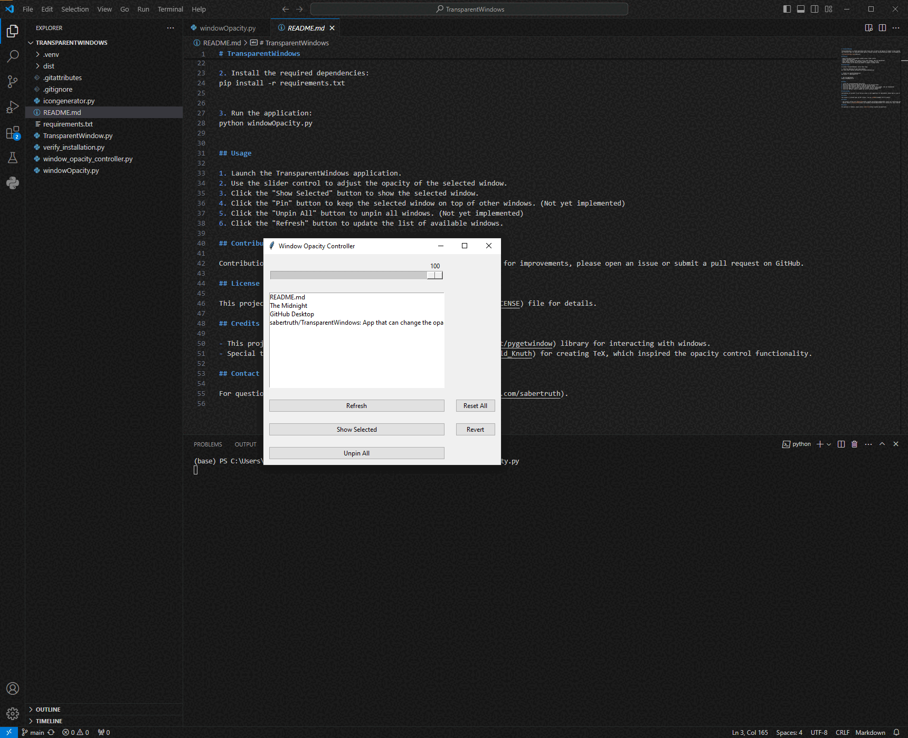

# TransparentWindows

TransparentWindows is a Python application that allows users to control the opacity of windows on their desktop environment. It provides a graphical user interface (GUI) for adjusting window opacity, Display selected, pinning/unpinning windows, and managing window visibility.

## Features

- Adjust the opacity of individual windows using a slider control.
- Display selected window
- Pin or unpin windows to keep them on top of other windows. (Not yet implemented)
- Reset opacity settings for individual windows or all windows at once.
- Refresh window list to detect new windows or changes in window titles.

## Installation

To install TransparentWindows, follow these steps:

1. Clone the repository to your local machine:
git clone https://github.com/sabertruth/TransparentWindows.git

2. Install the required dependencies:
pip install -r requirements.txt

3. Run the application:
python windowOpacity.py

## Usage

1. Launch the TransparentWindows application.
2. Use the slider control to adjust the opacity of the selected window.
3. Click the "Show Selected" button to show the selected window.
4. Click the "Pin" button to keep the selected window on top of other windows. (Not yet implemented)
5. Click the "Unpin All" button to unpin all windows. (Not yet implemented)
6. Click the "Refresh" button to update the list of available windows.

## Contributing

Contributions are welcome! If you find any issues or have suggestions for improvements, please open an issue or submit a pull request on GitHub.

## License

This project is licensed under the MIT License - see the [LICENSE](LICENSE) file for details.

## Credits

- This project utilizes the [pygetwindow](https://github.com/asweigart/pygetwindow) library for interacting with windows.
- Special thanks to [Donald Knuth](https://en.wikipedia.org/wiki/Donald_Knuth) for creating TeX, which inspired the opacity control functionality.

## Contact

For questions or feedback, please contact [sabertruth](https://github.com/sabertruth).
